# COVID-19 지식 그래프 생성기

**`LangChain`** 과 **`Google Gemini`** API를 사용하여 텍스트 입력에서 그래프 데이터(엔티티 및 관계)를 추출하고, 그래프 정보를 **`Neo4j`** GraphDB에 저장하며 인터랙티브 그래프를 시각화하는 **`Streamlit`** 애플리케이션입니다.
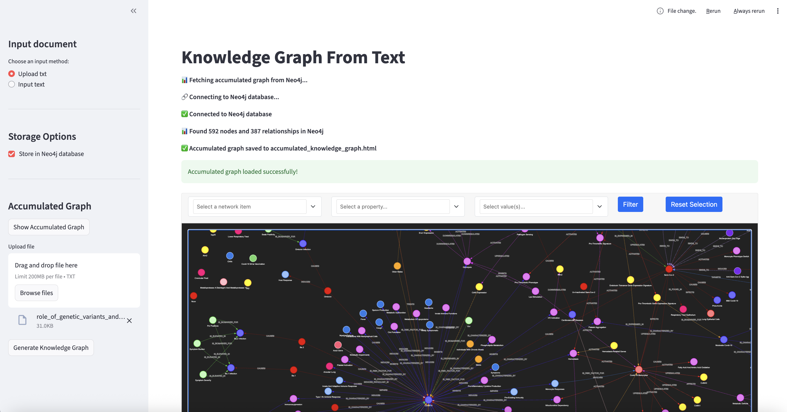

👉 이 저장소는 Thu Vu의 [Youtube 튜토리얼](https://www.youtube.com/watch?v=O-T_6KOXML4)과 [github 저장소](https://github.com/thu-vu92/knowledge-graph-llms)를 기반으로 만들어졌습니다:

COVID-19 논문 데이터는 [kaggle](https://www.kaggle.com/code/xhlulu/cord-19-eda-parse-json-and-generate-clean-csv/notebook)에 있는 데이터를 이용했습니다.

> **참조:**
> - [https://www.kaggle.com/code/xhlulu/cord-19-eda-parse-json-and-generate-clean-csv/notebook](https://www.kaggle.com/code/xhlulu/cord-19-eda-parse-json-and-generate-clean-csv/notebook)
> - [https://www.kaggle.com/datasets/allen-institute-for-ai/CORD-19-research-challenge/data](https://www.kaggle.com/datasets/allen-institute-for-ai/CORD-19-research-challenge/data)

## 기능
텍스트에서 그래프 데이터 추출, Graph DB에 데이터 저장, Streamlit UI 이용한 시각화

- 두 가지 입력 방법: 텍스트 업로드(.txt 파일) 또는 직접 텍스트 입력
- Google Gemini API를 활용한 엔티티 관계 추출
- Neo4j DB에 엔티티, 관계 저장
- 인터랙티브 지식 그래프 시각화
- 물리 기반 레이아웃을 통한 사용자 정의 가능한 그래프 표시

### 필수 요구사항

- **`Github`** 계정 및 **`Github Codespaces`** 세팅
- **`Neo4j`** 설정
- **`Google Gemini`** API 키

## 설정

### 1. Github 계정 및 Github Codespaces 설정

1. **새로운 탭 혹은 창에서** [https://github.com/](https://github.com/) 접속, 우상단 **`Sign up`** 클릭
2. **`Continue with Google`** 선택 혹은 정보 입력 후 **`Create account`** 선택 및 로그인
3. 이 저장소를 **자신의 github 저장소로 fork:**
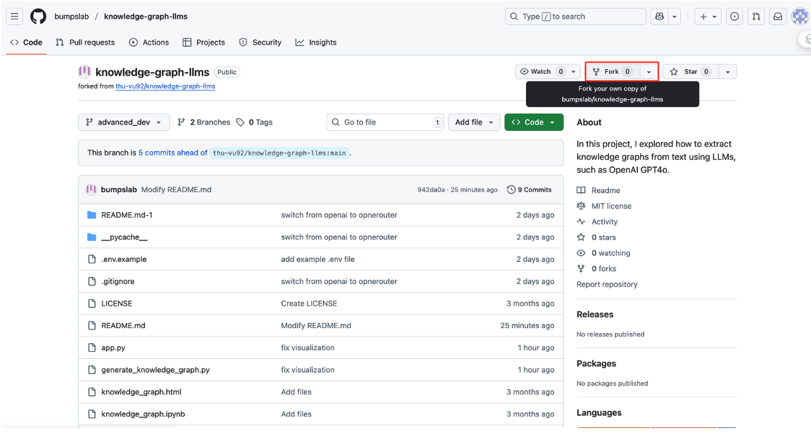

4. [https://github.com/features/codespaces?locale=ko-KR](https://github.com/features/codespaces?locale=ko-KR) 접속, **`무료로 시작하기`** 클릭
5. fork한 저장소를 이용하여 codespace 생성
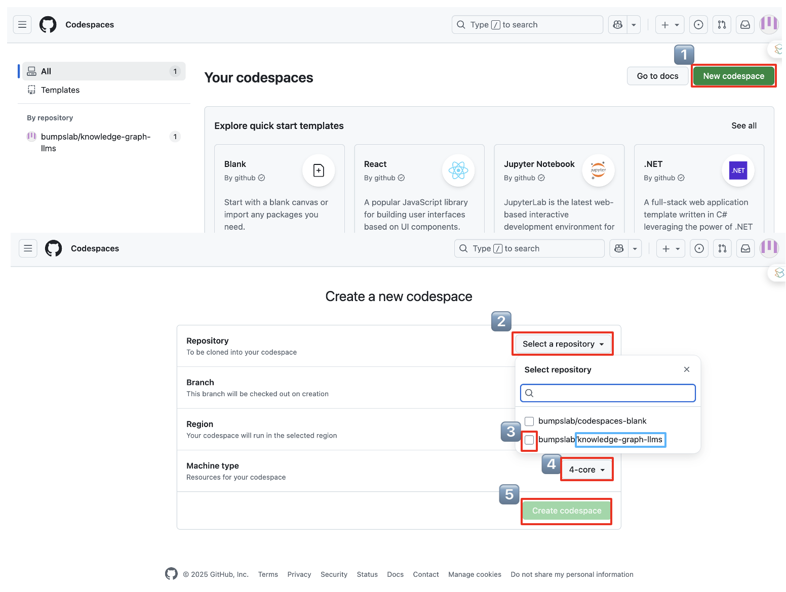

6. 다음과 같은 화면이 나올 시 정상적으로 완료된 상태 
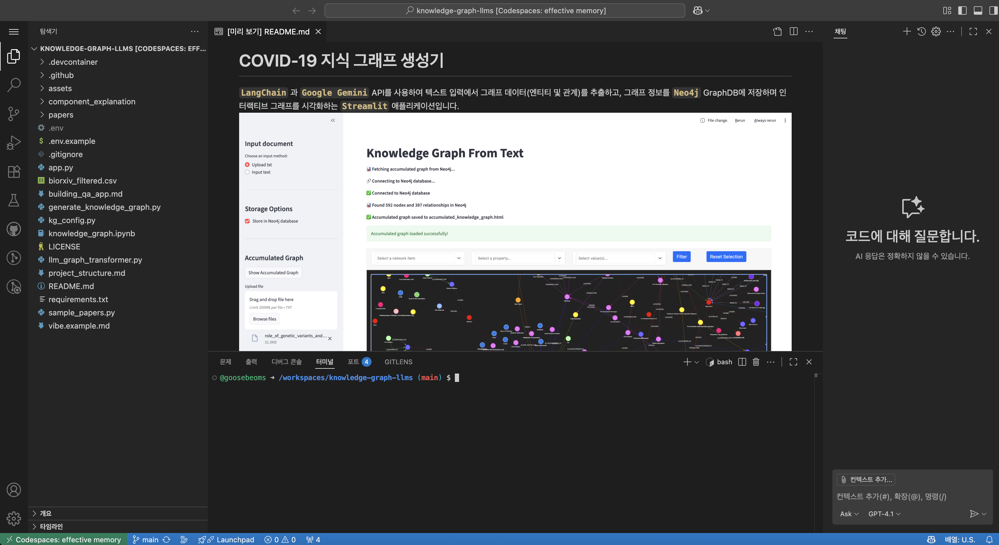

> **참고:**   
> 자신의 저장소를 이용해서 **`codespace`** 를 생성하게 되면
> **`git clone`** 을 한 것과 동일한 상태로 **`vscode`** 와 터미널을 사용할 수 있습니다.  
> **`codespace`** 를 사용하지 않는다면 터미널에서 **`git clone`** 을 실행해서 원격 저장소를 로컬로 불러와야 합니다.

---
### 2. Neo4j 설정

1. **새로운 탭 혹은 창에서** [https://neo4j.com/product/auradb/](https://neo4j.com/product/auradb/)로 이동하여 **`Start Free`** 클릭
2. **`Continue with Google`** 클릭하고 로그인
3. 각 단계를 거쳐 필요한 정보 입력: **마구잡이로 입력해도 됩니다.**
4. **`Create instance`** 클릭
5. **`Download to Continue`** 클릭
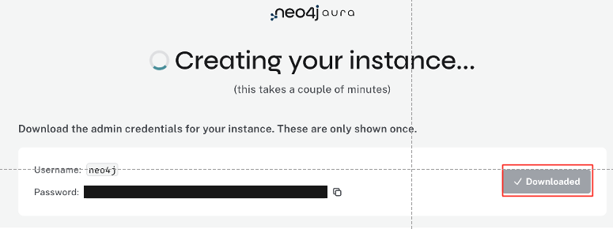
6. .txt 파일이 **`Downloads`** 디렉토리에 있는지, 다음과 같은 정보를 포함하는지 확인
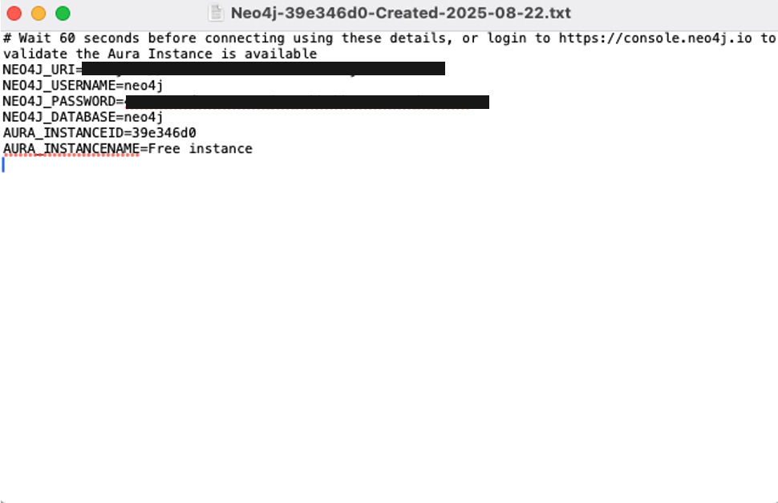

페이지 로딩에 시간이 걸리니 다음 단계로 계속 진행하시면 됩니다.

---
### 3. Google Gemini API 키 가져오기

1. Google API를 생성하기 위해 **새로운 탭 혹은 창에서** [**`Google Cloud Console`**](https://console.cloud.google.com/?authuser=2)을 열고 Project를 생성해야 합니다.
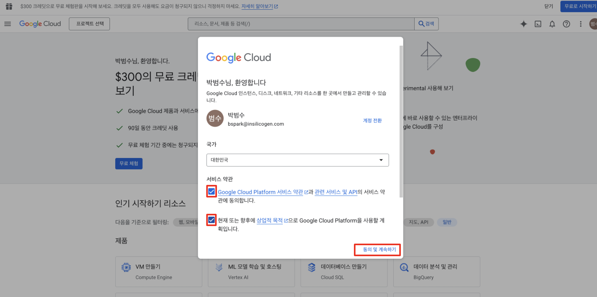
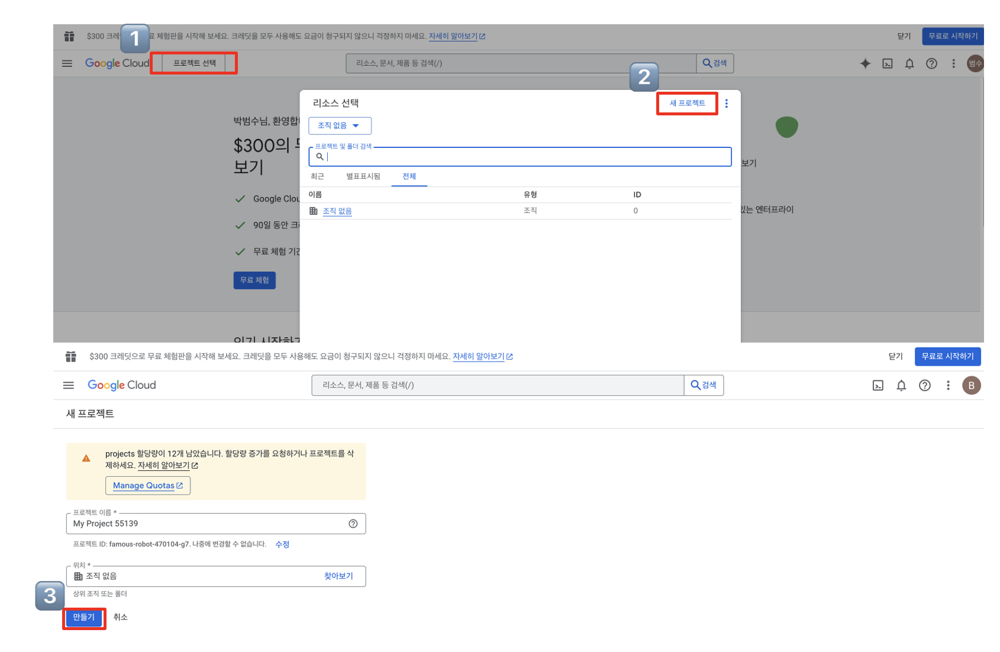
2. **새로운 탭 혹은 창에서** [https://aistudio.google.com/](https://aistudio.google.com/)로 이동, 우측 상단에 **`Get started`** 클릭
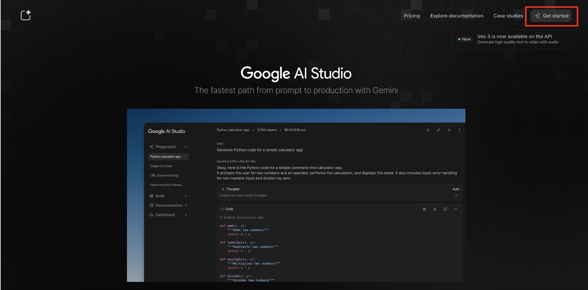
3. 좌하단 혹은 우상단의 **`Get API key`** 클릭
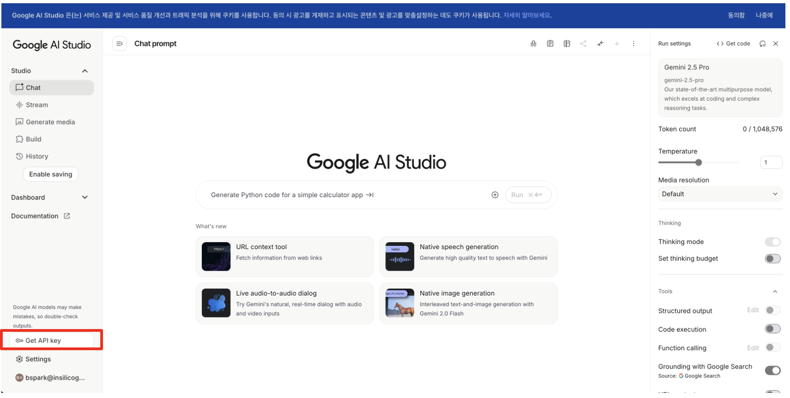
4. 우상단의 **`+ API 키 만들기`** 클릭
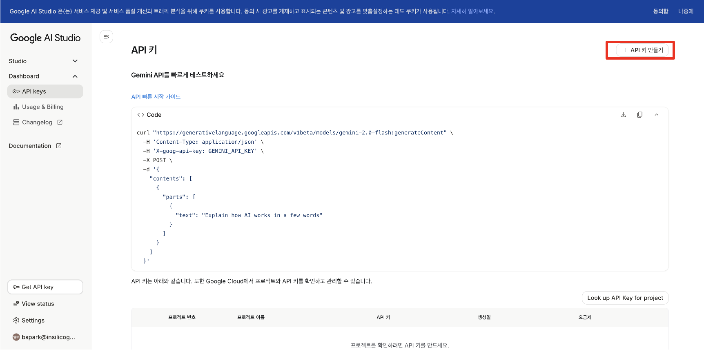
5. **`기존 프로젝트에 API 키 만들기`** 선택
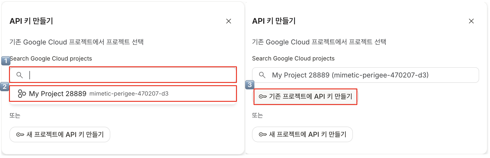
6. 생성된 API Key 안전한 곳에 복사하여 **쉽게 접근할 수 있는 곳에 저장하고 다른 사람과 공유하지 마십시오.**
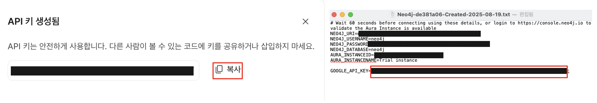

> **주의:** Google Gemini API로 Gemini Flash 2.5 모델 사용 시 무료 할당량으로 분당 10회, 일일 250회 요청 제한이 있습니다.  
> **참고:** [Google Cloud](https://cloud.google.com/free?hl=ko&_gl=1*1km53bs*_ga*MTc0NDIwOTA4NC4xNzUyNDUwOTIx*_ga_WH2QY8WWF5*czE3NTYyNjQ4NzYkbzEyJGcwJHQxNzU2MjY0ODc2JGo2MCRsMCRoMA..)에서 무료로 90일간 제공하는 $300 크레딧을 이용할 수 있습니다. 관심 있으신 분은 실습 이후에 이용 바랍니다.  
추가적으로 대학(원)생 분들은 2025.10.06까지 [여기](https://gemini.google/students/?hl=ko)에서 신청하면 **Gemini의 Pro 버전을 1년간 무료**로 사용할 수 있습니다.
---
## 설치
**의존성(패키지를 실행시키기 위한 패키지) 설치**를 위해 **`uv`** 사용을 권장합니다. **`uv`** 를 설치하고 가상 환경을 활성화하십시오.  
**`uv`** 설치:
```bash
curl -LsSf https://astral.sh/uv/install.sh | sh
```

가상 환경 생성 및 활성화:
```
uv venv 
source .venv/bin/activate
```

### 의존성

이 패키지가 작동하기 위해서는 다음 Python 패키지가 설치 되어있어야 합니다.

- **`langchain (>= 0.1.0)`**: 핵심 LLM 프레임워크
- **`langchain-experimental (>= 0.0.45)`**: 실험적 LangChain 기능
- **`langchain-google-genai (>= 0.1.0)`**: LangChain용 Google Gemini 통합
- **`langchain-neo4j`**: LangChain용 Neo4j 통합
- **`python-dotenv (>= 1.0.0)`**: 환경 변수 지원
- **`pyvis (>= 0.3.2)`**: 그래프 시각화
- **`streamlit (>= 1.32.0)`**: 웹 UI 프레임워크

제공된 **`requirements.txt`** 파일을 사용하여 모든 **필수 의존성을 설치하십시오:**

```bash
uv pip install -r requirements.txt
```
---
### Google Gemini API Key와 Neo4j 자격 증명

**루트 디렉토리**에 **`Google Gemini API`** 키, **`Neo4j`** uri 및 자격 증명이 포함된 **`.env`** **파일을 생성하세요:**
```
GOOGLE_API_KEY=your_google_api_key_here
NEO4J_URI=your_neo4j_url_here
NEO4J_USERNAME=your_neo4j_username_here
NEO4J_PASSWORD=your_neo4j_password_here
```
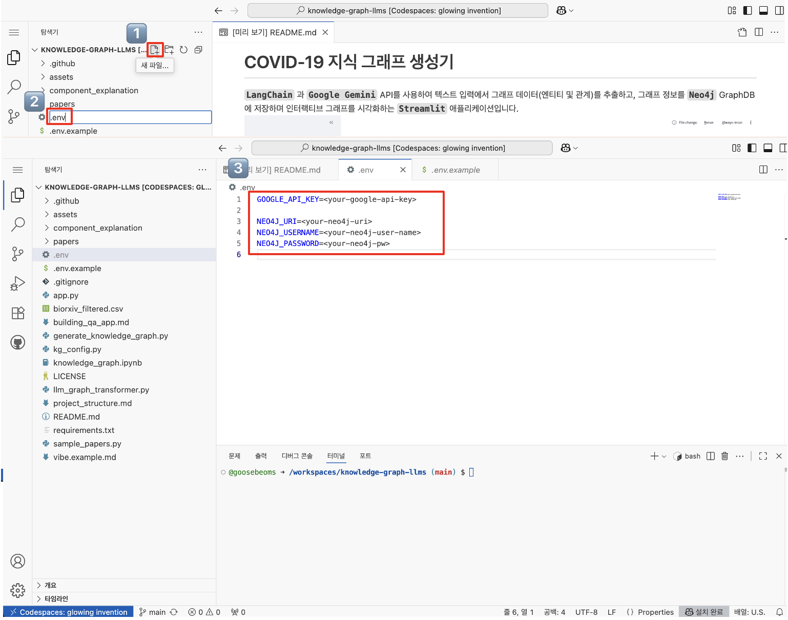
---
## 애플리케이션 실행

**`Streamlit`** 앱을 실행하려면:

```bash
streamlit run app.py
```

이렇게 하면 애플리케이션이 시작되고 기본 웹 브라우저에서 열립니다(일반적으로 http://localhost:8501).

## 사용법

1. 사이드바에서 입력 방법을 선택하기 (txt 업로드 또는 텍스트 입력)
2. 파일을 업로드하는 경우 컴퓨터에서 .txt 파일을 선택하기
3. 직접 입력을 사용하는 경우 텍스트 영역에 텍스트를 입력하거나 붙여넣기
4. "Generate Knowledge Graph" 버튼을 클릭하기
5. 그래프가 생성될 때까지 기다리기 (텍스트 길이에 따라 몇 분 정도 소요될 수 있습니다)
6. 인터랙티브 지식 그래프를 탐색하기:
   - 노드를 드래그하여 그래프를 재배치
   - 노드와 엣지에 마우스를 올려 추가 정보 확인
   - 마우스 휠을 사용하여 확대/축소
   - 특정 노드와 엣지에 대해 그래프 필터링

#### Neo4j 콘솔에서 지식 그래프 생성 결과 확인
1. Neo4j aura console에서 **`Dashboards`** 클릭 후 Dashboard를 Instance와 연결하기
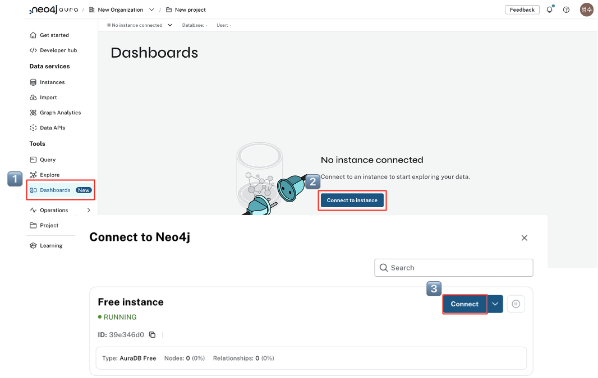

2. Cypher text query를 이용해서 DB에서 노드 쿼리 하기 [공식 문서 참조](https://neo4j.com/docs/cypher-manual/current/introduction/)
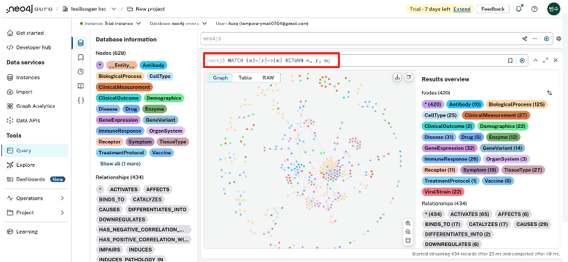

> **참고:** GPT등 LLM에게 물어봐도 되고 Neo4j에서도 LLM을 이용해 자연어 쿼리를 Cypher text 쿼리로 바꿔주는 기능을 제공합니다.[공식 문서 참조](https://neo4j.com/labs/neodash/2.4/user-guide/extensions/natural-language-queries/)

## 코드 고도화

1. Github Copilot을 이용해 코드베이스에 대해 질문해보고 기능들에 대해 구체적으로 이해해보세요.[어플리케이션 작동 원리](#어플리케이션-작동-원리)와 [project_structure.md](./project_structure.md)에서도 간략히 확인 가능합니다.
2. 이 저장소의 **`vibe.example.md`** 를 참고해서 코드를 고도화해봅시다.  
   > 꼭 예제의 흐름대로 가지 않으셔도 됩니다. 자유롭게 시도해보세요.
3. 코드 수정 및 고도화를 진행해보면서 버전관리를 같이 진행해보세요.
   > **기본 git 개념과 git 명령어들을 학습해보세요.**  
   > **`git add`**, **`git commit`**, **`git push`** : **변경사항 반영** 관련 명령어  
   > **`git status`**,**`git log`**, **`git config`** : **상태 확인** 관련 명령어  
   > **`git branch`**, **`git switch`**, **`git checkout`**, **`git reset`** : **버전 생성 및 변경, 이동** 관련 명령어  
   > **`git merge`**, **`git rebase`** : **버전 병합** 관련 명령어  
   > **`git clone`**, **`git fetch`**, **`git pull`** : **원격 저장소 불러오기** 관련 명령어   

## 어플리케이션 작동 원리

이 애플리케이션은 **`Google Gemini API`** 를 통해 **`Gemini-2.5-Flash`** 모델에 접근하고, **`LangChain`** 의 **`LLMGraphTransformer`** 를 사용하여 텍스트에서 지식 그래프를 생성합니다:

### 1. 텍스트 처리 및 엔터티 추출
- **`Google Gemini API`** 를 통해 Gemini-2.5-Flash 모델에 접근
- 긴 논문 텍스트를 여러 개의 chunk로 쪼갠 후 병렬적으로 API 요청을 통해 엔티티, 관계 추출 요청
- API rate 제한 준수를 위한 자동 청크 제한 (분당 10회 요청 제한)
- **`LLMGraphTransformer`** 가 입력 텍스트를 분석하여 엔터티(인물, 조직, 장소, 개념 등)를 식별
- 엔터티 간의 의미적 관계를 추출하여 구조화된 그래프 데이터로 변환

### 2. Neo4j 그래프 데이터베이스 저장
- 추출된 엔터티와 관계를 **`Neo4j GraphDB`** 에 영구 저장
- 각 노드에 소스 문서명과 생성 시간 등 메타데이터 추가
- 여러 문서의 지식을 누적하여 종합적인 지식 그래프 구축

### 3. 인터랙티브 시각화
- **`PyVis`** 를 사용하여 그래프를 인터랙티브 HTML로 변환
- 물리 기반 레이아웃으로 노드와 엣지를 동적 배치
- 필터링, 확대/축소, 드래그 등 다양한 상호작용 기능 제공

### 4. 누적 지식 관리
- 여러 문서에서 추출된 지식을 하나의 통합된 그래프로 결합
- 문서 간 공통 엔터티 연결을 통한 지식 네트워크 확장
- 시간에 따른 지식 축적과 관계 발견 지원


## 라이선스

이 프로젝트는 MIT 라이선스 하에 라이선스됩니다 - 소프트웨어의 자유로운 사용, 수정 및 배포를 허용하는 허용적 오픈 소스 라이선스입니다.

자세한 내용은 [MIT 라이선스](https://opensource.org/licenses/MIT) 문서를 참조하세요.  

## 연락처
**어려운 실습하느라 정말 수고 많으셨습니다!!**
궁금한 사항이 있으시다면 **`bspark@insilicogen.com`**   
이메일로 말씀해주시면 **`2~3 영업일`** 내에 최대한 답변해드리겠습니다. 🤗**편하게 연락주세요**🤗