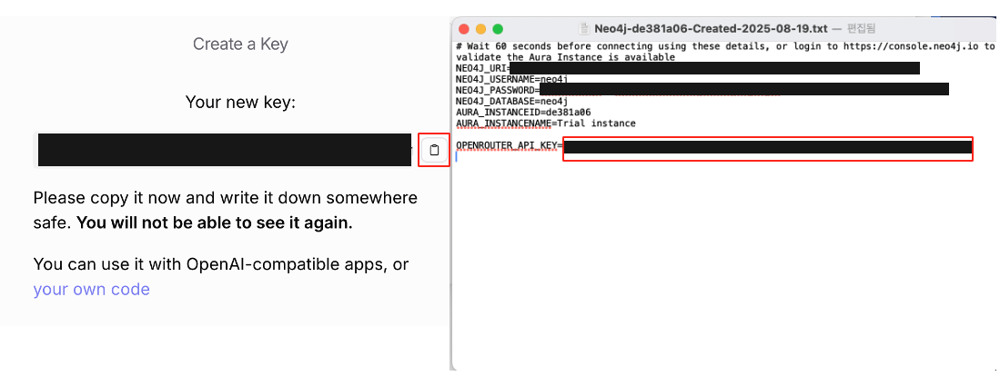

# 지식 그래프 생성기

LangChain과 OpenRouter API를 사용하여 텍스트 입력에서 그래프 데이터(엔터티 및 관계)를 추출하고, 그래프 정보를 Neo4j 그래프 데이터베이스에 저장하며 인터랙티브 그래프를 시각화하는 Streamlit 애플리케이션입니다.


👉 이 저장소는 Thu Vu의 Youtube 튜토리얼의 일부입니다:
[](https://www.youtube.com/watch?v=O-T_6KOXML4)

## 기능

- 두 가지 입력 방법: 텍스트 업로드(.txt 파일) 또는 직접 텍스트 입력
- 인터랙티브 지식 그래프 시각화
- 물리 기반 레이아웃을 통한 사용자 정의 가능한 그래프 표시
- OpenRouter API에서 제공하는 LLM을 활용한 엔터티 관계 추출


### 필수 요구사항

- Github 계정 및 Github Codespaces 세팅
- Neo4j 설정
- OpenRouter API 키

### 설정

### Github 계정 및 Github Codespaces 설정

1. [https://github.com/](https://github.com/) 접속, 우상단 'Sign up' 클릭
2. 'Continue with Google' 선택 혹은 정보 입력 후 'Create account' 선택
3. 다음 [링크](https://github.com/bumpslab/knowledge-graph-llms)에 접속하여 이 저장소를 자신의 github 저장소로 Fork:

4. [https://github.com/features/codespaces?locale=ko-KR](https://github.com/features/codespaces?locale=ko-KR) 접속, '무료로 시작하기' 클릭
5. Fork한 저장소를 이용하여 codespace 생성


### Neo4j 설정

1. [https://neo4j.com/product/auradb/](https://neo4j.com/product/auradb/)로 이동하여 'Start Free'를 클릭
2. 'Continue with Google'을 클릭하고 로그인
3. 각 단계를 거쳐 필요한 정보를 입력
4. 'Create instance'를 클릭
5. 'Download to Continue'를 클릭

6. .txt 파일이 'Downloads' 디렉토리에 있는지 확인
7. 페이지 로딩 완료 시 'Dashboards' 클릭 후 Dashboard를 Instance와 연결하기


### OpenRouter API 키 가져오기

1. [https://openrouter.ai/](https://openrouter.ai/)에서 github으로 로그인
2. 'Authorize OpenRouterTeam'을 클릭
3. 우측 상단 아이콘을 클릭하고 'Keys'를 클릭

4. 'Create API Key'를 클릭

5. 이름을 입력하고 credit limit을 0으로 설정한 후 'Create'를 클릭

6. API 키를 복사하여 쉽게 접근할 수 있는 곳에 저장고 다른 사람과 공유하지 마십시오.


## 설치
의존성(패키지를 실행시키기 위한 패키지) 설치를 위해 uv 사용을 권장합니다. uv를 설치하고 가상 환경을 활성화하세요.
uv 설치:
```bash
curl -LsSf https://astral.sh/uv/install.sh | sh
```

가상 환경 생성 및 활성화:
```
uv venv 
source .venv/bin/activate
```

### 의존성

이 애플리케이션은 다음 Python 패키지가 필요합니다:

- langchain (>= 0.1.0): 핵심 LLM 프레임워크
- langchain-experimental (>= 0.0.45): 실험적 LangChain 기능
- langchain-openai (>= 0.1.0): LangChain용 OpenAI 통합
- langchain-neo4j: LangChain용 Neo4j 통합
- python-dotenv (>= 1.0.0): 환경 변수 지원
- pyvis (>= 0.3.2): 그래프 시각화
- streamlit (>= 1.32.0): 웹 UI 프레임워크

제공된 requirements.txt 파일을 사용하여 모든 필수 의존성을 설치하십시오:

```bash
uv pip install -r requirements.txt
```

### 원격 저장소 로컬로 가져오기

1. 로컬(Github Codespaces) terminal에서 자신의 저장소를 clone 하십시오.
```bash
git clone [repository-url]
```
   참고: `[repository-url]`을 이 자기 저장소의 실제 URL로 바꾸세요.

2. 루트 디렉토리에 OpenRouter API 키, Neo4j uri 및 자격 증명이 포함된 `.env` 파일을 생성하세요:
   ```
   OPENROUTER_API_KEY=your_openai_api_key_here
   NEO4J_URI=your_neo4j_url_here
   NEO4J_USERNAME=your_neo4j_username_here
   NEO4J_PASSWORD=your_neo4j_password_here
   ```

## 애플리케이션 실행

Streamlit 앱을 실행하려면:

```bash
streamlit run app.py
```

이렇게 하면 애플리케이션이 시작되고 기본 웹 브라우저에서 열립니다(일반적으로 http://localhost:8501).

## 사용법

1. 사이드바에서 입력 방법을 선택하세요 (txt 업로드 또는 텍스트 입력)
2. 파일을 업로드하는 경우 컴퓨터에서 .txt 파일을 선택하세요
3. 직접 입력을 사용하는 경우 텍스트 영역에 텍스트를 입력하거나 붙여넣기 하세요
4. "Generate Knowledge Graph" 버튼을 클릭하세요
5. 그래프가 생성될 때까지 기다리세요 (텍스트 길이에 따라 몇 분 정도 소요될 수 있습니다)
6. 인터랙티브 지식 그래프를 탐색하세요:
   - 노드를 드래그하여 그래프를 재배치
   - 노드와 엣지에 마우스를 올려 추가 정보 확인
   - 마우스 휠을 사용하여 확대/축소
   - 특정 노드와 엣지에 대해 그래프 필터링

## 작동 원리

이 애플리케이션은 OpenAI의 GPT-4o 모델과 함께 LangChain의 실험적 그래프 변환기를 사용하여:
1. 입력 텍스트에서 엔터티를 추출
2. 이러한 엔터티 간의 관계를 식별
3. 이 정보를 나타내는 그래프 구조를 생성
4. vis.js 시각화 라이브러리를 위한 Python 인터페이스인 PyVis를 사용하여 그래프를 시각화

## 라이선스

이 프로젝트는 MIT 라이선스 하에 라이선스됩니다 - 소프트웨어의 자유로운 사용, 수정 및 배포를 허용하는 허용적 오픈 소스 라이선스입니다.

자세한 내용은 [MIT 라이선스](https://opensource.org/licenses/MIT) 문서를 참조하세요.
